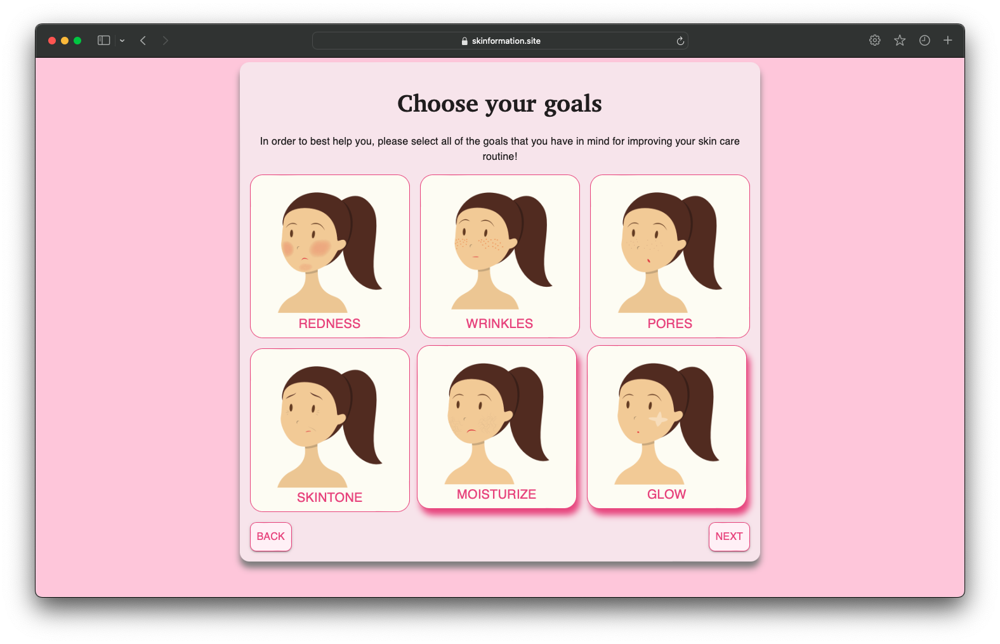
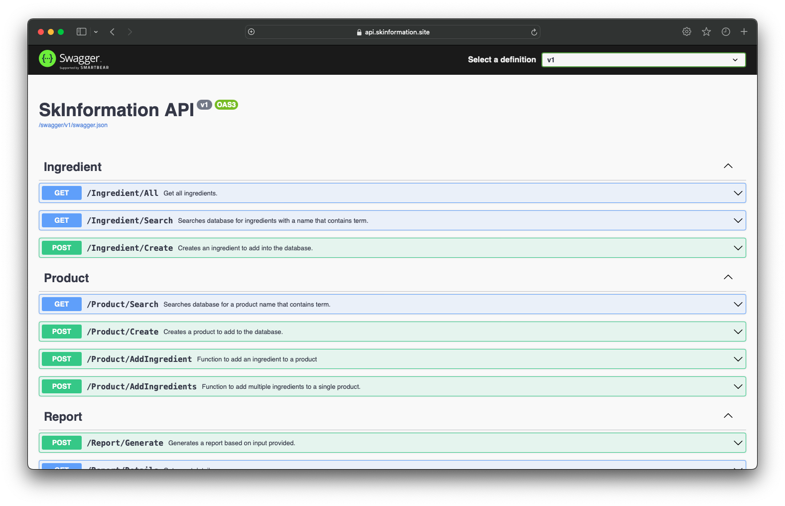

# SkInformation

SkInformation is a web app to help improve your skincare health and achieve your goals. Simply fill-out a short survey and get a customized report.

### Features
- [x] Supports various skin types (dry, oily, combination, normal)
- [x] Supports various skin goals (e.g., reduce redness, pore appearance, skin tone, etc.)
- [x] Search for products currently used
- [x] Add new products if they do not exist
- [x] Generate a report detailing recommended products and potential irritating ingredients
- [x] Optionally email the user the report to view at a later time

## Application Frontend

## Application Backend

## How to Run
Docker support coming soon.